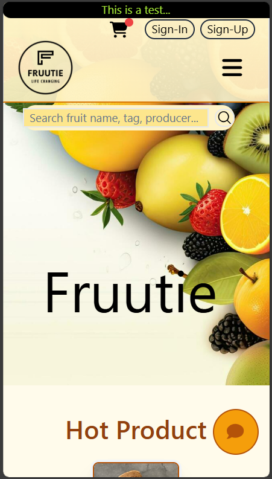
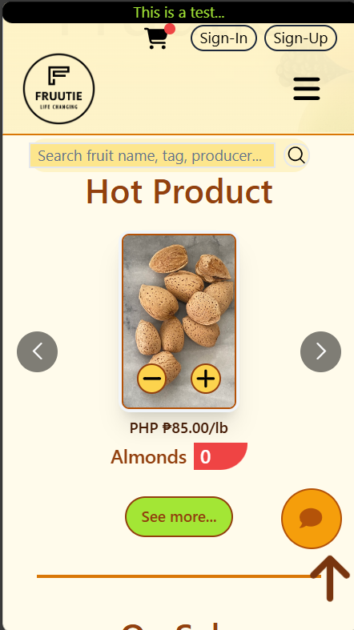
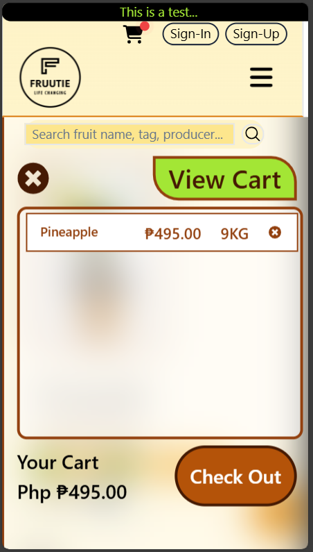
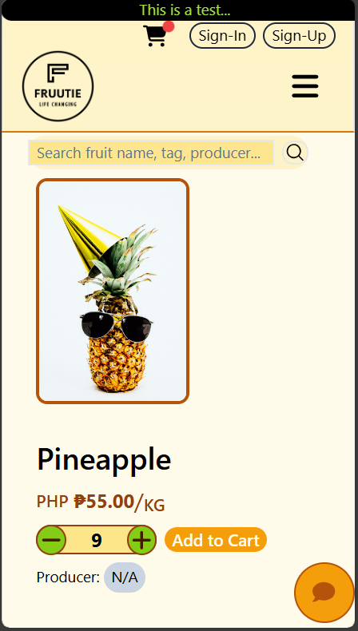

# 0.1.99.6

# This web-base app project is created for educational purposes only and is not intended for commercial use.

## Type of website: (SPA) Single Page Application


# React + TypeScript + Vite

This template provides a minimal setup to get React working in Vite with HMR and some ESLint rules.

Currently, two official plugins are available:

- [@vitejs/plugin-react](https://github.com/vitejs/vite-plugin-react/blob/main/packages/plugin-react/README.md) uses [Babel](https://babeljs.io/) for Fast Refresh
- [@vitejs/plugin-react-swc](https://github.com/vitejs/vite-plugin-react-swc) uses [SWC](https://swc.rs/) for Fast Refresh

## Expanding the ESLint configuration

If you are developing a production application, we recommend updating the configuration to enable type aware lint rules:

- Configure the top-level `parserOptions` property like this:

```js
export default {
  // other rules...
  parserOptions: {
    ecmaVersion: 'latest',
    sourceType: 'module',
    project: ['./tsconfig.json', './tsconfig.node.json'],
    tsconfigRootDir: __dirname,
  },
}
```

- Replace `plugin:@typescript-eslint/recommended` to `plugin:@typescript-eslint/recommended-type-checked` or `plugin:@typescript-eslint/strict-type-checked`
- Optionally add `plugin:@typescript-eslint/stylistic-type-checked`
- Install [eslint-plugin-react](https://github.com/jsx-eslint/eslint-plugin-react) and add `plugin:react/recommended` & `plugin:react/jsx-runtime` to the `extends` list


# Home page
## Desktop mode
## 
## 
## Mobile mode
## <div style="display: flex; flex-direction: row;width:100%;place-content:space-evenly;place-items:center;flex-wrap:wrap;"></div>
# Cart Floating Section
## Desktop mode
## 
## Mobile mode
## <div style="display: flex; flex-direction: row;width:100%;place-content:space-evenly;place-items:center;flex-wrap:wrap;"></div>

# Info Product page
## Desktop mode
## 
## Mobile mode
## <div style="display: flex; flex-direction: row;width:100%;place-content:center;place-items:center;flex-wrap:wrap;"></div>

## Start the Demo by Clicking the Link Below
We would like to express our gratitude to the Netlify organization and communities around it for their support.

### [Try the Demo Now:  it106-fruutie.netlify.app](https://it106-fruutie.netlify.app)
